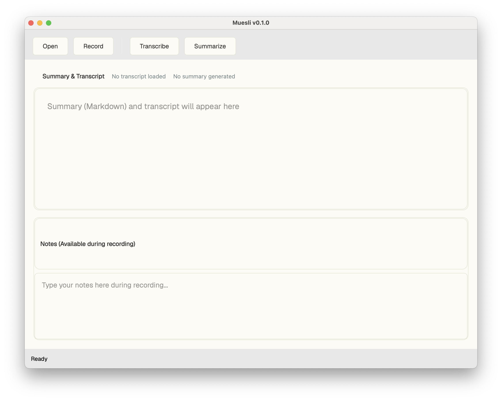

# Muesli



Offline-first, privacy-centric voice **transcription** and **summarisation** desktop application powered by  
[whisper.cpp](https://github.com/ggerganov/whisper.cpp) and a local LLM served by [Ollama](https://ollama.ai/).

---

## Features

- 🎙️ Microphone transcription with whisper.cpp
- 📂 “Open File” transcription for WAV / MP3 / M4A / FLAC / OGG
- 🧠 Local LLM summarisation – generated automatically right after transcription
- 📝 Single combined markdown view
- 💾 Save combined content as **.md**, **.txt**, or **.srt** (auto-generated block)
- 🌗 Dark / Light / System theme
- 💻 Runs completely offline

---

## Project Structure

```
muesli/
├── __init__.py
├── LICENSE
├── main.py
├── models
├── models.py
├── Muesli.spec
├── muesli.yaml.example
├── ollama_client.py
├── prompt.md
├── pyproject.toml
├── README.md
├── requirements.txt
├── scripts
│   └── bootstrap_muesli_mac.sh
├── stream_processor.py
├── summarizer.py
├── ui
│   ├── __init__.py
│   ├── compile_resources.py
│   ├── main_window.py
│   ├── qml
│   │   └── main.qml
│   ├── resources
│   │   └── loading.svg
│   ├── resources_rc.py
│   └── resources.qrc
└── whisper_wrapper.py
```

---

## Requirements

| Requirement            | Purpose                      |
| ---------------------- | ---------------------------- |
| Python **3.8 +**       | Core application             |
| `whisper.cpp` binary   | On-device speech-to-text     |
| `ffmpeg` (recommended) | Decode/convert non-WAV audio |
| Ollama (optional)      | Local LLM for summaries      |

Python deps are listed in `requirements.txt`

---

## Installation

> [!WARNING]  
> This downloads ~12 GB worth of files, mostly taken up by llama 8b and whisper medium. It also spews stuff across your file system in unexpected ways. Check the script before running.

```bash
git clone https://github.com/JBlitzar/muesli
bash scripts/bootstrap_muesli_mac.sh
uv sync
```

### 4. Run

```bash
python main.py
```

---

## Usage

### Graphical UI

1. Start `muesli` (`python main.py`)
2. Click **Open File** _or_ **Record**
3. When you stop recording (or when file transcription ends) a summary is generated automatically and shown above the transcript.
4. Save the combined markdown via **File → Save Content…**

---

## Component Details

| Component                                                | Notes                                                                                                    |
| -------------------------------------------------------- | -------------------------------------------------------------------------------------------------------- |
| **WhisperTranscriber** (`whisper_wrapper.py`)            | Spawns whisper.cpp via `subprocess`, streams progress, verifies model checksum.                          |
| **TranscriptionStreamProcessor** (`stream_processor.py`) | Captures microphone audio with PyAudio, performs VAD, chunks audio into ~5 s segments, feeds to Whisper. |
| **OllamaClient** (`ollama_client.py`)                    | Thin subprocess wrapper around the `ollama run` CLI (no HTTP), supports streaming responses.             |
| **TranscriptSummarizer** (`summarizer.py`)               | Builds prompt templates and calls `OllamaClient` to get summary.                                         |
| **MuesliApp** (`main.py`)                                | Loads config, sets up components, exposes Qt signals for UI.                                             |
| **UI** (`ui/`)                                           | PySide6 widgets + optional QML; auto-updates via Qt signals.                                             |

---

## Development

```bash
git clone https://github.com/JBlitzar/muesli
bash scripts/bootstrap_muesli_mac.sh
black .       # format
isort .       # import order
ruff format . # format, again
```

---

## Troubleshooting

_Haha, good luck. This project is kind of a mess. But check the traceback. It's pretty well structured. If it is reproducable and would be helpful, feel free to leave an issue and I'll try my best to respond and update this section_

### whisper.cpp CLI cheat-sheet

```
whisper -m ggml-medium.en.bin \
        -f audio.wav \
        --language en \
        --output-dir out/ \
        --output-json transcript.json \
        --output-txt true \
        --beam-size 5
```

> Muesli internally generates a similar command; use it as a reference when debugging. I used it as a reference when debugging, at least.

## License

The source code is released under the **GNU GPLv3 License**.  
Whisper model weights are distributed under their respective licenses (MIT for GGML binaries).  
“Whisper” and “GPT” are trademarks of their respective owners.

Enjoy your breakfast 🥣.  
– JBlitzar
